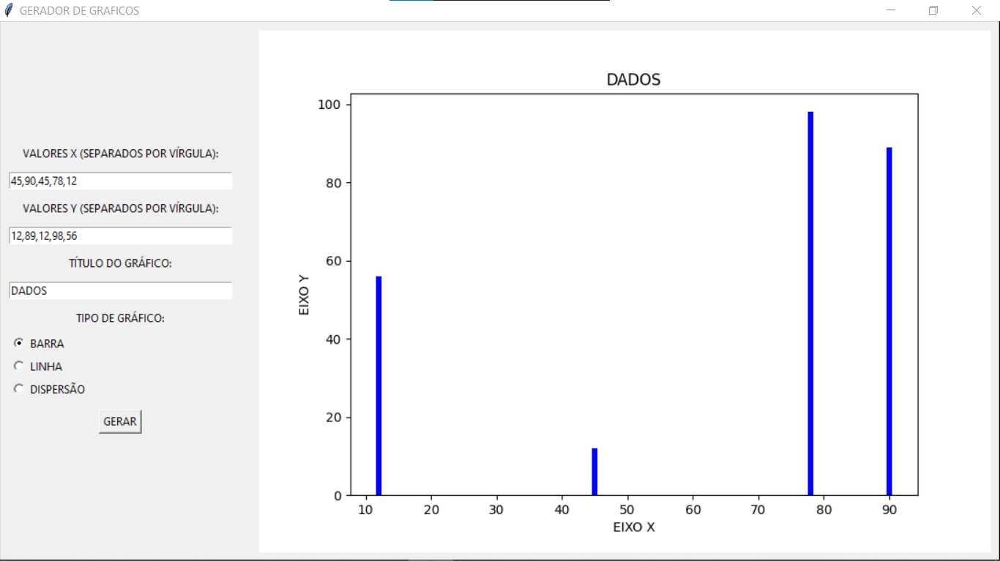
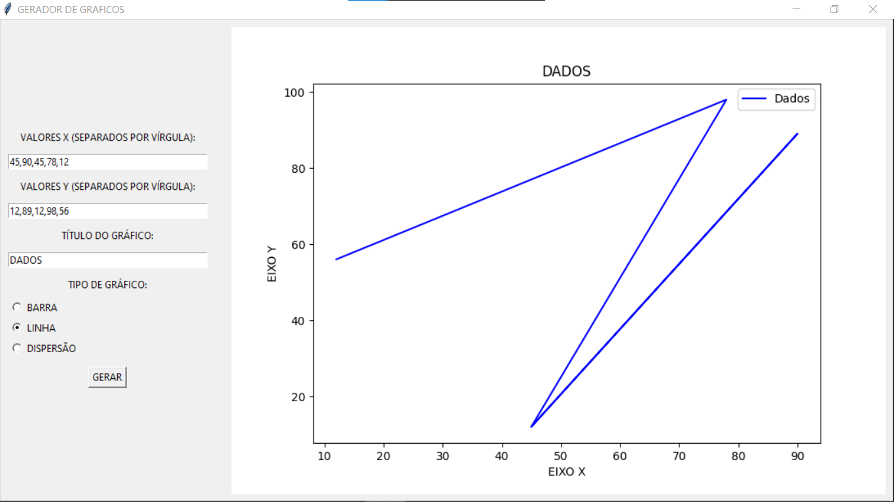
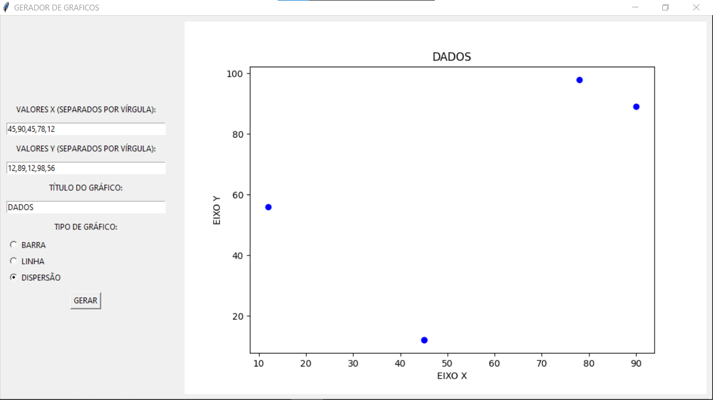

# GERADOR DE GRAFICOS
👨‍🏫ESSE APP PERMITE QUE O USUÁRIO INSIRA DADOS PERSONALIZADOS E ESCOLHA ENTRE DIFERENTES TIPOS DE GRÁFICOS PARA VISUALIZAR ESSES DADOS.

 <br>
 <br>
 <br>

## DESCRIÇÃO:
O **Gerador de Gráficos** é um aplicativo desenvolvido em Python utilizando as bibliotecas Tkinter e Matplotlib. Ele permite que o usuário insira dados personalizados e escolha entre diferentes tipos de gráficos para visualizar esses dados. Este aplicativo é útil para gerar visualizações rápidas e interativas de conjuntos de dados fornecidos pelo usuário.

## FUNCIONALIDADES:
1. **Entrada de Dados:**
   - O usuário pode inserir valores para os eixos X e Y através de campos de entrada de texto. Os valores devem ser separados por vírgulas.
   
2. **Título do Gráfico:**
   - O usuário pode especificar um título personalizado para o gráfico.

3. **Seleção do Tipo de Gráfico:**
   - O usuário pode escolher entre três tipos de gráficos:
     - Barra
     - Linha
     - Dispersão

4. **Geração e Exibição do Gráfico:**
   - Após inserir os dados e selecionar o tipo de gráfico, o usuário pode clicar no botão "GERAR" para criar e visualizar o gráfico.

5. **Barra de Ferramentas:**
   - O gráfico gerado é exibido junto com uma barra de ferramentas interativa, fornecendo funcionalidades adicionais como zoom, pan, salvar a figura, etc.

## EXECUTANDO ESSE PROJETO:
1. **Instalação das Dependências:**
   - Entre no diretório `CODIGO` e execute o comando:

   ```bash
   pip install -r requirements.txt
   ```

2. **Executando o Código:**
   - Para executar o arquivo Python, utilize o comando abaixo no terminal, dentro do diretório `./CODIGO`:

   ```
   python CODIGO.py
   ```

3. **Inserir Dados:**
   - Nos campos "VALORES X" e "VALORES Y", insira os valores separados por vírgulas. Certifique-se de que o número de valores em X e Y seja o mesmo.
   - Exemplo:
     - Valores X: `1, 2, 3, 4`
     - Valores Y: `10, 20, 30, 40`

4. **Título do Gráfico:**
   - Opcionalmente, insira um título para o gráfico no campo "TÍTULO DO GRÁFICO".

5. **Selecionar Tipo de Gráfico:**
   - Escolha o tipo de gráfico que deseja gerar (Barra, Linha ou Dispersão) clicando nos botões de rádio correspondentes.

6. **Gerar o Gráfico:**
   - Clique no botão "GERAR" para criar o gráfico com base nos dados fornecidos e nas opções selecionadas.

7. **Visualizar e Interagir com o Gráfico:**
   - O gráfico será exibido no lado direito da janela. Utilize a barra de ferramentas fornecida para interagir com o gráfico (zoom, pan, salvar, etc.).

## NÃO SABE?
- Entendemos que para manipular arquivos em muitas linguagens, é necessário possuir conhecimento nessas áreas. Para auxiliar nesse aprendizado, oferecemos cursos gratuitos disponíveis:
* [CURSO DE PYTHON](https://github.com/VILHALVA/CURSO-DE-PYTHON)
* [CURSO DE TKINTER](https://github.com/VILHALVA/CURSO-DE-TKINTER)
* [CONFIRA MAIS CURSOS](https://github.com/VILHALVA?tab=repositories&q=+topic:CURSO)

## CREDITOS:
- [PROJETO CRIADO PELO VILHALVA](https://github.com/VILHALVA)


